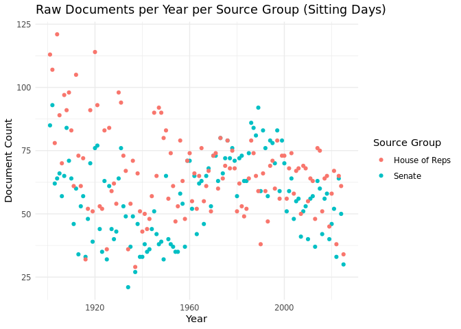

# Federal Hansard DB Dem
Alfie Chadwick
2025-11-12

``` r
required_packages <- c("DBI", "RPostgres", "dplyr", "ggplot2")

to_install <- setdiff(required_packages, rownames(installed.packages()))
if(length(to_install)) install.packages(to_install)
```

------------------------------------------------------------------------

## Grab Raw Documents

``` sql
SELECT
    sg.id AS group_id,
    sg.name AS group_name,
    EXTRACT(YEAR FROM d.date) AS year,
    COUNT(DISTINCT rd.id) AS raw_document_count,
    COUNT(rd.id) as document_count
FROM
    "RawDocument" rd
JOIN
    "Source" s ON rd."sourceId" = s.id
JOIN
    "_SourceToSourceGroup" stsg ON stsg."A" = s.id
JOIN
    "SourceGroup" sg ON sg.id = stsg."B"
JOIN
    "Document" d ON d."rawDocumentId" = rd.id
WHERE
    sg.id IN (2,3)
    AND d.date IS NOT NULL
GROUP BY
    sg.id, sg.name, year
ORDER BY
    sg.id, year
```

------------------------------------------------------------------------

## Hansard Documents

``` r
# Coerce types if necessary
doc_counts <- doc_counts %>%
  mutate(year = as.integer(as.character(year)),
         document_count = as.integer(document_count),
         raw_document_count = as.integer(raw_document_count),
         group_name = as.factor(group_name))

# Basic plot
ggplot(doc_counts, aes(x = year, y = raw_document_count, color = group_name)) +
  geom_point() +
  labs(
    title = "Raw Documents per Year per Source Group (Sitting Days)",
    x = "Year",
    y = "Document Count",
    color = "Source Group"
  ) +
  theme_minimal()
```



``` r
# Basic plot
ggplot(doc_counts, aes(x = year, y = document_count, color = group_name)) +
  geom_point() +
  labs(
    title = "Documents per Year per Source Group (Speeches)",
    x = "Year",
    y = "Document Count",
    color = "Source Group"
  ) +
  theme_minimal()
```


